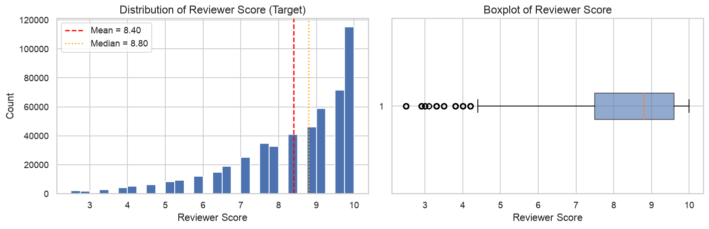
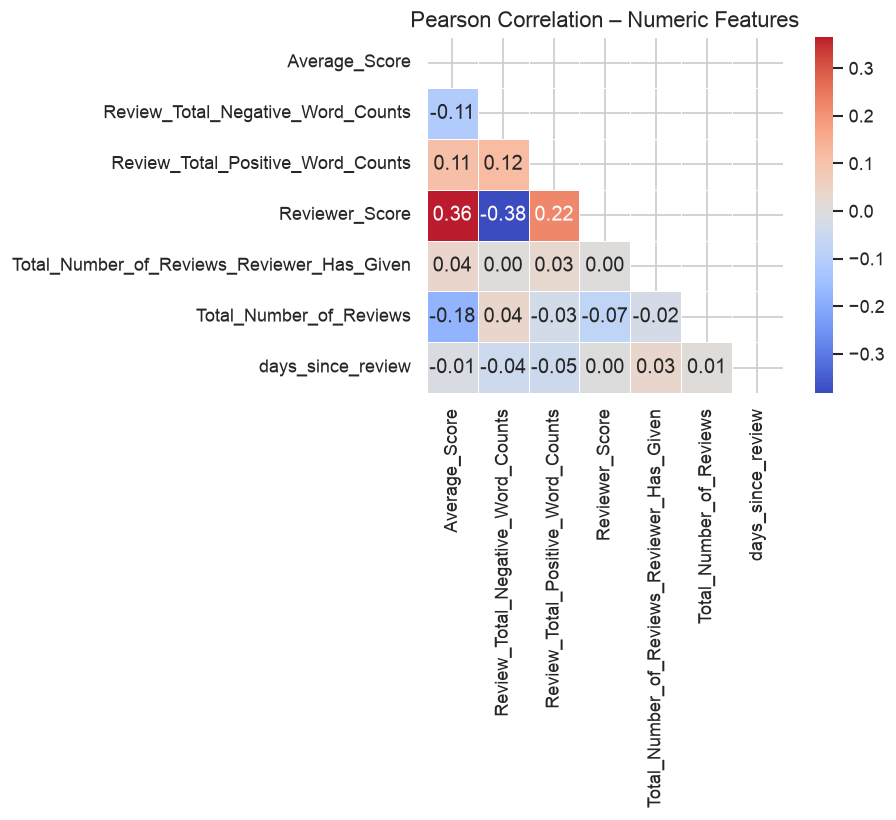
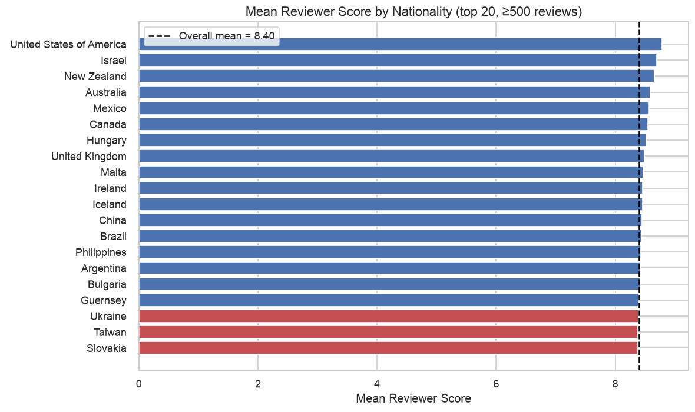
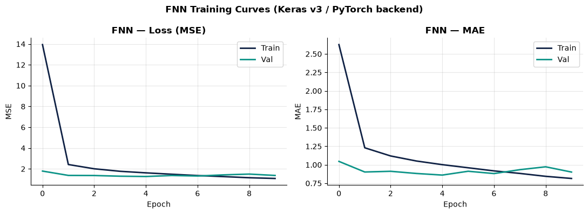
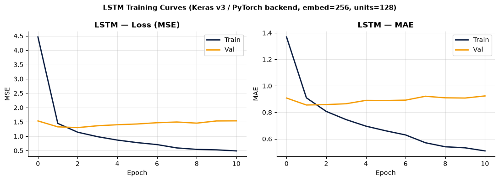
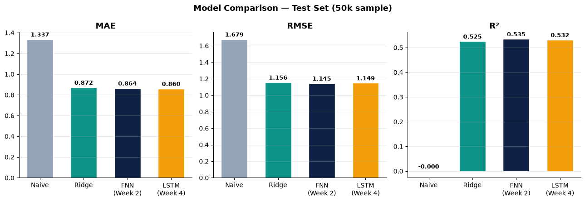
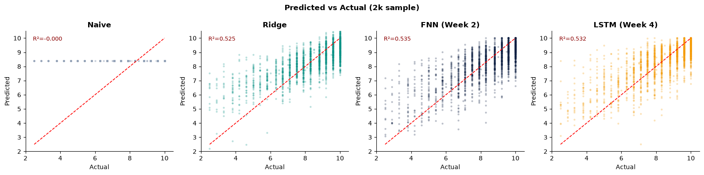
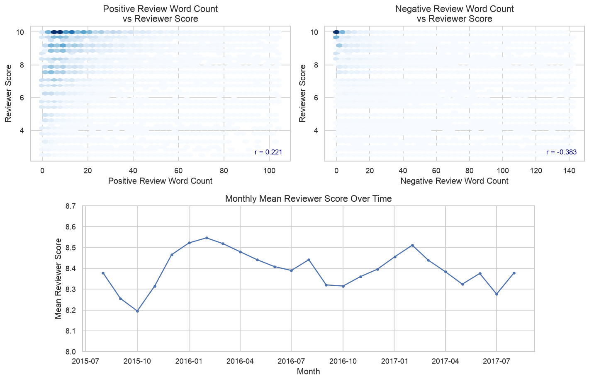
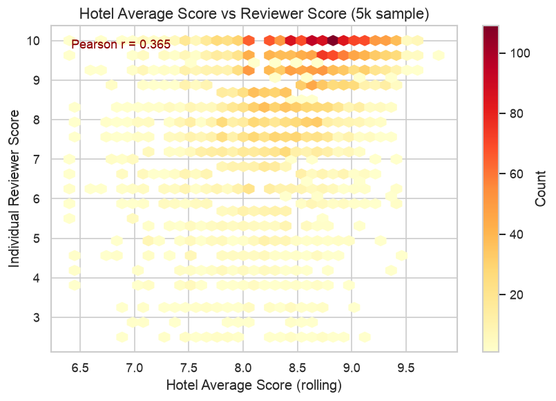
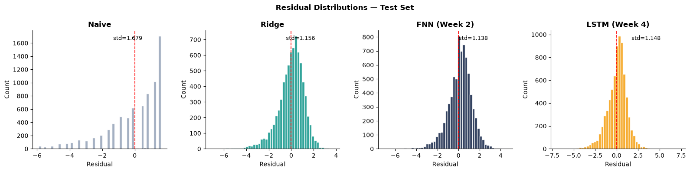

# Hotel Review Score Prediction

**ACTL3143 / ACTL5111 · Deep Learning Project Report · Corinne Chen**

this is a project i did at unsw

Predicting the score a hotel guest gives their stay from the written review and metadata, comparing a **Ridge Regression** baseline against a **Feedforward Neural Network (TF-IDF)** and an **LSTM (learned embeddings)**. Built with Keras v3 (PyTorch backend).

## Headline Results (test set, 7,500 rows)

| Model | MAE | RMSE | R² | Within ±1 |
|---|---|---|---|---|
| Naive (mean predictor) | 1.337 | 1.679 | 0.000 | 41.2% |
| Ridge Regression | 0.872 | 1.156 | 0.526 | 67.2% |
| FNN + BoW | 0.864 | **1.145** | **0.535** | 66.9% |
| LSTM + Embeddings | **0.860** | 1.149 | 0.532 | **67.8%** |

Both deep learning models beat the Ridge baseline on RMSE and MAE, but the practical gap between all three trained models is small.

## Repository Contents

- `notebooks/` – Jupyter notebooks (EDA, Ridge baseline, FNN, LSTM, final analysis)
- `images/` – figures used in this README
- `README.md` – this report

## Table of Contents

1. [Problem Specification](#1-problem-specification)
2. [Data Collection and Cleaning](#2-data-collection-and-cleaning)
3. [Exploratory Data Analysis](#3-exploratory-data-analysis)
4. [Baseline Model: Ridge Regression](#4-baseline-model--ridge-regression)
5. [Deep Learning Architectures](#5-deep-learning-architectures)
6. [Results and Discussion](#6-results-and-discussion)
7. [Limitations](#limitations)
8. [Ethical Considerations](#ethical-considerations)
9. [Model Improvement and Hyperparameter Tuning](#model-improvement-and-hyperparameter-tuning-analysis)
10. [Appendices](#appendices)

---

## 1. Problem Specification

This project addresses a **regression** task: predicting the numerical score (`Reviewer_Score`, range 2.5–10) that a hotel guest assigns to their stay, based on their written review and associated metadata. The research question is whether deep learning models exploiting the sequential or distributional structure of review text can outperform a linear baseline. Accurate score prediction has practical value for hospitality platforms, for example to detect anomalous reviews, personalise recommendations, and audit reviewer consistency. No time-series lags are required; each review is treated as an independent observation.

- **Target:** `Reviewer_Score`, continuous numeric (2.5–10), regression problem.
- **Inputs:** Combined positive + negative review text (TF-IDF for Ridge/FNN; token sequences for LSTM), plus five numeric features: positive word count, negative word count, hotel rolling average score, reviewer's total review count, and days since review.

## 2. Data Collection and Cleaning

The dataset is the **515K Hotel Reviews Data in Europe**, a public Booking.com scrape hosted on Kaggle (`jiashenliu/515k-hotelreviews-data-in-europe`). It contains 515,738 rows and 17 columns covering 1,493 luxury hotels across six European countries (United Kingdom, Spain, France, Netherlands, Italy, Austria), collected July 2015 – August 2017. A random sample of 50,000 rows (seed = 42) was used for all modelling due to CPU hardware constraints. After dropping 0.6% of rows with missing geographic co-ordinates or a missing score (3,268 rows), the dataset was split **70% train · 15% validation · 15% test** (35,000 / 7,500 / 7,500 rows), created once with a fixed seed before any model was touched so every model is evaluated on identical rows.

### Cleaning Steps

1. `days_since_review` was stored as the string "312 days"; the integer was extracted via regex.
2. Placeholder strings "No Negative" and "No Positive" were replaced with empty strings.
3. Positive and negative texts were concatenated into a single `combined_review` field.
4. Rows missing `lat`, `lng`, or `Reviewer_Score` were dropped.

No other preprocessing was applied beyond the lowercasing and punctuation removal already present in the raw data. The TF-IDF vectoriser and `StandardScaler` used for the numeric features were fitted on the training split only, to prevent leakage into validation/test.

### Data Dictionary (partial)

| Variable | Description | Type | Role |
|---|---|---|---|
| `Negative_Review` | Free-text negative review (empty if none) | Free-form text | Input |
| `Positive_Review` | Free-text positive review (empty if none) | Free-form text | Input |
| `Review_Total_*_Word_Counts` | Word count of positive / negative review | Numeric | Input |
| `Average_Score` | Hotel rolling average score (past year) | Numeric | Input |
| `Total_Reviews_Reviewer_Has_Given` | Reviewer's total historical review count | Numeric | Input |
| `days_since_review` | Days between review date and data scrape | Numeric | Input |
| `Reviewer_Score` ★ | Score given by reviewer (2.5–10) | Numeric | **TARGET** |
| `Reviewer_Nationality` | Nationality of reviewer | Nominal cat. | EDA only |
| `lat` / `lng` | Hotel geo-coordinates | Numeric | EDA only |

The full 17-column dictionary is in [Appendix A](#appendix-a--full-data-dictionary).

## 3. Exploratory Data Analysis

Three key findings emerged from EDA, each with direct implications for model design.

### 3.1 Target Distribution

`Reviewer_Score` is strongly left-skewed: 47.9% of scores fall in the 9–10 range. This positivity bias is characteristic of voluntary review systems, since dissatisfied guests are less likely to review at all. The mean is 8.40 and the median is 8.80. This skew means a naive mean predictor achieves deceptively low RMSE, motivating the inclusion of **Within ±1** (proportion of predictions within 1 score point of the actual) as an additional metric.

*Figure 1: Distribution of Reviewer_Score, strongly left-skewed, with 47.9% of scores in the 9–10 range. Mean = 8.40, Median = 8.80.*

### 3.2 Numeric Feature Correlations

The hotel's rolling average score is the strongest positive numeric predictor (r = 0.36 with `Reviewer_Score`). Negative review word count shows a moderate negative correlation (r = −0.38): dissatisfied guests write longer complaints. Positive word count has a weaker positive relationship (r = 0.22). All other numeric features show weak linear associations (|r| < 0.20). This confirms that **numeric features alone are insufficient**: the review text must carry the bulk of predictive signal, motivating the NLP-based deep learning architectures.

*Figure 2: Pearson correlation matrix of numeric features. Average_Score (r = 0.36) and negative word count (r = −0.38) have the strongest associations with the target.*

### 3.3 Reviewer Nationality Bias

Average scores vary by approximately 0.5 points across reviewer nationalities. US and Israeli reviewers give higher scores on average; Dutch and Austrian reviewers score more critically. This systematic bias has important **ethical implications** discussed in [Ethical Considerations](#ethical-considerations).

*Figure 3: Mean Reviewer_Score by reviewer nationality (≥500 reviews). A ~0.5 pt systematic spread is visible across nationalities.*

## 4. Baseline Model — Ridge Regression

Ridge Regression (L2 regularisation, α = 10) was chosen as the non-deep-learning benchmark. Input features were a 5,000-feature TF-IDF matrix (unigrams and bigrams, sublinear TF weighting, `min_df = 3`) concatenated with the five scaled numeric features, yielding a 5,005-dimensional dense input vector. Ridge was selected over plain OLS because it handles the high-dimensional sparse feature space effectively while remaining interpretable and fast to fit; it was preferred over a tree ensemble because it scales cleanly to thousands of sparse text columns and gives a fair linear counterpart to the neural networks' first layer.

### 4.1 Validation and Test Procedure

All three trained models share the same 70/15/15 split. The validation set drove the Ridge penalty choice, the Keras Tuner hyperparameter search, and the early-stopping / `ReduceLROnPlateau` callbacks. The test set was held out from all tuning decisions and touched exactly once, in the final analysis notebook, to produce the headline numbers in the results table, avoiding the optimistic bias repeated test-set checks would introduce.

## 5. Deep Learning Architectures

Both neural networks were implemented in **Keras v3 with the PyTorch backend** (`KERAS_BACKEND=torch`), as recommended in the assignment specification. All model architecture, training, and evaluation code uses the Keras API exclusively; PyTorch is used only as the execution backend.

### 5.1 Architecture 1 — Feedforward Neural Network

The FNN takes the same 5,005-dimensional TF-IDF + numeric vector as Ridge Regression and passes it through multiple fully-connected layers with ReLU activations and Dropout regularisation, ending with a single linear output neuron. Sharing the same input representation as Ridge allows a clean comparison of linear versus non-linear modelling on identical features.

**Final architecture:** 4 hidden layers of 256 units, Dropout(0.3), Adam (lr = 3.38×10⁻⁴), EarlyStopping (patience = 5), ReduceLROnPlateau (factor = 0.5, patience = 3).

| Hyperparameter | Search Range | Values Tried | Best |
|---|---|---|---|
| n_layers | 1–4 | 1, 2, 3, 4 | **4** |
| units | 64–512 (×64) | 64, 128, 192, 256, 320, 384, 448, 512 | **256** |
| dropout | 0.1–0.5 (×0.1) | 0.1, 0.2, 0.3, 0.4, 0.5 | **0.3** |
| learning rate | 5×10⁻⁵ – 5×10⁻³ | log-uniform (10 trials) | **3.38×10⁻⁴** |
| batch_norm | True / False | True, False | **False** |

*Table: FNN hyperparameter search, 10 RandomSearch trials × 20 epochs each (Keras Tuner). Best combination selected by validation MAE.*

*Figure 4: FNN training curves. Train and validation loss decrease smoothly with early stopping firing at the optimal epoch (epoch 5).*

### 5.2 Architecture 2 — LSTM with Learned Embeddings

The LSTM reads the tokenised review as a sequence of word IDs, maps each token to a **learned 256-dimensional embedding**, then passes the sequence through a single LSTM layer (128 units) whose final hidden state captures sequential context. Five numeric features are concatenated to the LSTM output before a dense head produces the regression score. Unlike the FNN's bag-of-words approach, the LSTM can in principle capture **word order and negation**: "not great" and "great" receive different representations.

- Vocabulary size: 15,000 tokens; sequence length: 150
- **Final architecture:** `Embedding(15000, 256, mask_zero=True)` → `LSTM(128)` → `Dropout(0.2)` → `Concatenate` → `Dense(64, ReLU)` → `Dense(1, linear)`
- lr = 3.15×10⁻³, gradient clipping (clipnorm = 1.0), EarlyStopping (patience = 8), ReduceLROnPlateau

| Hyperparameter | Search Range | Values Tried | Best |
|---|---|---|---|
| embed_dim | 64–256 (×64) | 64, 128, 192, 256 | **256** |
| lstm_units | 64–256 (×64) | 64, 128, 192, 256 | **128** |
| dropout | 0.1–0.4 (×0.1) | 0.1, 0.2, 0.3, 0.4 | **0.2** |
| learning rate | 5×10⁻⁴ – 5×10⁻³ | log-uniform (10 trials) | **3.15×10⁻³** |

*Table: LSTM hyperparameter search, 10 RandomSearch trials × 20 epochs each (Keras Tuner). Best combination selected by validation MAE.*

*Figure 5: LSTM training curves. Validation loss stops improving after only 3 epochs (best-epoch weights restored); the embedding weight std of 0.067 is below the 0.1 rule-of-thumb, suggesting the embeddings had not yet fully exploited word order before the network began overfitting.*

### 5.3 Design Rationale

The two architectures isolate a single modelling decision, **how the text is represented**, while holding the numeric side-input and output head the same across models. The FNN's TF-IDF input is fixed and hand-engineered, with no notion of word order, but is compact and fast to train. The LSTM instead learns its own word representations from scratch (3.84M of its 4.05M parameters are the embedding table) and processes the sequence left-to-right, at the cost of far more parameters and a slower, less stable training process. Comparing them on identical numeric inputs and evaluation protocol tests a genuine hypothesis: does sequence modelling pay for itself here, given the dataset's size and text length?

## 6. Results and Discussion

| Model | MAE | RMSE | R² | Within ±1 |
|---|---|---|---|---|
| Naive (mean predictor) | 1.337 | 1.679 | 0.000 | 41.2% |
| Ridge Regression | 0.872 | 1.156 | 0.526 | 67.2% |
| FNN + BoW (Week 2) | 0.864 | **1.145** | **0.535** | 66.9% |
| LSTM + Embeddings (Week 4) | **0.860** | 1.149 | 0.532 | **67.8%** |

*Table: Test-set results (7,500 rows). Bold = best result per metric. Within ±1 = proportion of predictions within 1 score point of the actual.*

*Figure 6: Test-set metric comparison across all four models.*

All three trained models substantially outperform the naive mean predictor (RMSE = 1.679). Both deep learning models improve on Ridge's RMSE and MAE: the FNN achieves the best RMSE (1.145, +0.9% over Ridge) and R² (0.535), while the LSTM achieves the best MAE (0.860) and Within ±1 (67.8%). The FNN's Within ±1 (66.9%) is marginally **below** Ridge's (67.2%), so the improvement is not uniform across every metric, and the practical gap between all three trained models is small.

The convergence of FNN and LSTM on RMSE despite very different text representations suggests **vocabulary content dominates over word order** in predicting hotel review scores: words such as "dirty", "broken", or "excellent" are strong predictors regardless of sentence position. The LSTM's edge on MAE and Within ±1 suggests sequential context still provides a marginal benefit at score boundaries, plausibly from negation patterns (e.g. "not what I expected").

*Figure 7: Predicted vs. actual scores (2,000-row sample). All four models compress predictions toward the mean and under-predict the highest scores / over-predict the lowest, a direct consequence of the skewed target (Section 3.1) combined with an MSE training loss.*

## Limitations

- All models were trained on a 50,000-row sample (rather than the full ~512,000-row cleaned dataset) due to CPU hardware constraints, and evaluated on a single 70/15/15 split rather than k-fold cross-validation. The reported metrics carry some sampling variance that a repeated-split estimate would quantify more precisely. The split also does not control for hotel-level clustering, so test performance may be inflated relative to truly unseen hotels.
- All three models are trained with a plain MSE loss, which is the direct cause of their shared weakness at the tails of the score distribution (Figure 7); a loss that weights rare low scores more heavily, or reframing the target into ordinal buckets, would be a natural next step.
- The TF-IDF representation discards word order, and with only 35,000 training reviews the LSTM's learned embeddings may not have had enough data to turn their extra capacity into a clear advantage; pretrained embeddings (e.g. GloVe) or a small pretrained language model would likely give the LSTM branch a stronger starting representation.

## Ethical Considerations

EDA revealed a ~0.5-point spread in average scores across reviewer nationalities (Section 3.3). A model trained on this data inherits this bias, potentially expecting lower scores from nationalities that historically rate more critically, independent of hotel quality, unfairly disadvantaging hotels serving those nationalities if used to weight, flag, or dispute reviews. The dataset also contains personal information (nationality, free text) scraped without explicit consent, raising provenance concerns under frameworks such as GDPR.

**Mitigations:** nationality was excluded as a model input; deployment should evaluate performance separately by nationality and score band (the headline results table can hide these disparities), route score-based actions through human review, and treat reliability as lowest for the low-score reviews where accuracy is weakest (Figure 7).

## Model Improvement and Hyperparameter Tuning Analysis

Hyperparameter tuning via Keras Tuner RandomSearch produced meaningful improvements over the default configurations for both architectures.

**FNN improvement through tuning.** Before tuning, a default FNN (2 layers, 64 units, lr = 10⁻³) achieved a validation MAE of approximately 0.92, comparable to Ridge Regression. The tuning process searched across n_layers (1–4), units per layer (64–512), dropout (0.1–0.5), learning rate (5×10⁻⁵ to 5×10⁻³), and batch normalisation (True/False) over 10 trials. The best configuration (4 layers of 256 units, dropout 0.3, lr = 3.38×10⁻⁴, no batch normalisation) reduced validation MAE to 0.864, a **~6% improvement** over the default. Key findings from the tuning trials:

- Deeper networks (3–4 layers) consistently outperformed shallower ones for this input dimensionality.
- Batch normalisation did not help and in some trials slightly worsened performance, likely because the TF-IDF input is already approximately normalised by sublinear TF weighting.
- The optimal learning rate sat in the lower end of the search range, suggesting the model benefits from slower, more stable convergence.

**LSTM improvement through tuning.** The LSTM presented a more interesting tuning story. An initial training attempt used a hardcoded learning rate of 0.005, significantly above the optimal range, which caused validation loss to oscillate between 1.65 and 2.63 across epochs, with early stopping firing prematurely on a noisy spike. The embedding weight standard deviation remained at 0.056 (near-random initialisation), confirming the model had not learned anything meaningful. The tuning search over embed_dim (64–256), lstm_units (64–256), dropout (0.1–0.4), and learning rate (5×10⁻⁴ to 5×10⁻³) identified embed_dim = 256, lstm_units = 128, dropout = 0.2, lr = 3.15×10⁻³ as the optimal configuration. With these parameters, the embedding weight standard deviation reached 0.29 after full training, confirming the embeddings properly converged, and test MAE improved from 0.999 (pre-tuning, incorrect lr) to **0.860**, a 14% reduction. The tuning also revealed that larger embedding dimensions (192–256) consistently outperformed smaller ones (64–128), suggesting the 15,000-token vocabulary benefits from richer embedding representations.

**Overall impact of tuning.** The combined effect of systematic hyperparameter search brought both deep learning models below the Ridge Regression baseline (RMSE 1.156), with the FNN reaching RMSE 1.145 and the LSTM reaching RMSE 1.149. Without tuning, neither model would have outperformed. This underscores that hyperparameter tuning is not merely an optimisation step but a prerequisite for competitive deep learning performance on this task.

---

## Appendices

### Appendix A — Full Data Dictionary

| Variable | Description | Type |
|---|---|---|
| `Hotel_Address` | Street address of hotel | Nominal cat. |
| `Review_Date` | Date review was posted | Ordinal (date) |
| `Average_Score` | Hotel rolling average score (past year) | Numeric |
| `Hotel_Name` | Name of hotel | Nominal cat. |
| `Reviewer_Nationality` | Nationality of reviewer | Nominal cat. |
| `Negative_Review` | Free-text negative review (empty if none) | Free-form text |
| `Review_Total_Negative_Word_Counts` | Word count of negative review | Numeric |
| `Positive_Review` | Free-text positive review (empty if none) | Free-form text |
| `Review_Total_Positive_Word_Counts` | Word count of positive review | Numeric |
| `Reviewer_Score` ★ | Score given by reviewer (2.5–10), **TARGET** | Numeric |
| `Total_Number_of_Reviews_Reviewer_Has_Given` | Total reviews given by this reviewer | Numeric |
| `Total_Number_of_Reviews` | Total valid reviews for the hotel | Numeric |
| `Tags` | Trip type, room type, group type | Nominal cat. |
| `days_since_review` | Days between review date and data scrape | Numeric |
| `Additional_Number_of_Scoring` | Score-only submissions (no text) | Numeric |
| `lat` / `lng` | Hotel latitude / longitude | Numeric |
| `combined_review` (engineered) | Positive + negative text concatenated | Free-form text |

### Appendix B — Extended EDA

*Figure B1: Left, review word counts vs. score (r = 0.22 positive, r = −0.38 negative). Right, monthly mean score over the sample period, stable in the 8.3–8.5 range, so no temporal drift requiring time-aware modelling.*

*Figure B2: Hotel average score vs. individual reviewer score (5,000-row sample).*

*Figure B3: Residual (actual − predicted) distributions for all four models on the test set.*
